# Food Recommendation Ontology / Logical-Programming

## Table of Contents
- [Installation and Usage](#installation-and-usage)
- [Overview](#overview)
- [Features](#features)
- [Technical Details](#technical-details)
  - [Key Classes](#key-classes)
  - [Applying Disjoint Classes](#applying-disjoint-classes)
  - [Relationships Between Classes](#relationships-between-classes)
  - [Assigning Domain and Range to Object Properties](#assigning-domain-and-range-to-object-properties)
  - [Data Properties and Relations](#data-properties-and-relations)
  - [Property and Value Restrictions](#property-value-restrictions)
  - [Applying Closure Axiom](#applying-closure-axiom)
  - [Changing a Primitive Class to a Defined Class](#changing-a-primitive-class-to-a-defined-class)
  - [Using the Reasoner](#using-the-reasoner)
- [Applications](#applications)
- [Examples](#examples)
- [Conclusion](#conclusion)
- [Contributing](#contributing)
- [License](#license)
- [Contact](#contact)

## Installation and Usage

To utilize the Food Recommendation Ontology, clone this repository to your local machine using the following command:

git clone https://github.com/mo-rahimi/Logical-Programming-Food-Recommendation-Ontology.git

Once cloned, you can open the ontology files in any OWL-compatible editor, such as Protégé, to explore and manipulate the ontology.

- Written in OWL (Web Ontology Language)
- Developed using Protégé [5.5.0]
- Installation and Usage: (https://protege.stanford.edu)

## Overview
This repository contains a comprehensive food ontology written in OWL (Web Ontology Language). The primary goal of this ontology is to provide a standardized vocabulary and semantic structure for describing food products and ingredients. It aims to facilitate personalized nutritional recommendations that support healthy eating by leveraging a sophisticated framework of related concepts.

    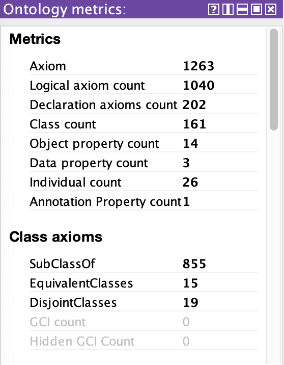
    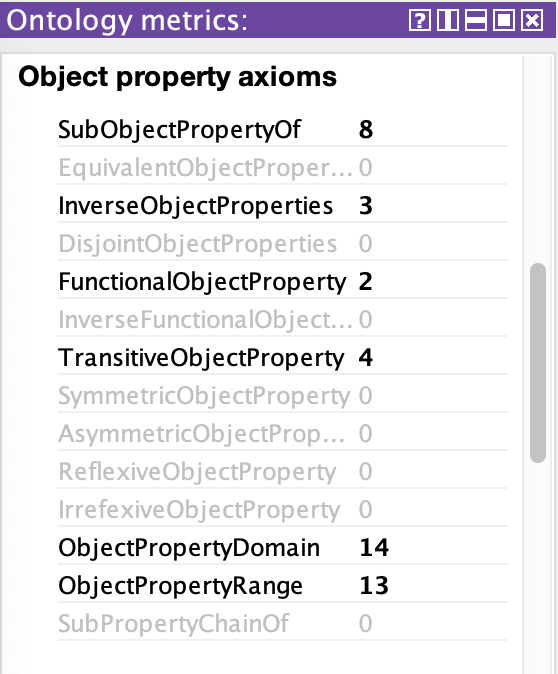
    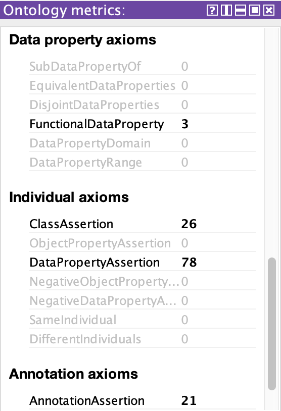

## Features
- **Standardized Vocabulary:** Provides a common language for describing food-related concepts.
- **Personalized Recommendations:** Facilitates tailored nutritional advice based on individual dietary needs and preferences.
- **Comprehensive Class Structure:** Includes a wide range of classes representing dishes, ingredients, nutrients, and user preferences.
- **Disjoint Class Definitions:** Ensures clarity in categorization by defining disjoint classes within the ontology.
- **Reasoning Capabilities:** Supports reasoning to infer new knowledge from existing data.

## Technical Details
### Key Classes
- **Dish**: Represents a dish made from various ingredients.
- **Ingredient**: Classifies ingredients into animal-based and plant-based categories.
- **Nutrition**: Includes subclasses for carbohydrates, fats, fibers, proteins, minerals, and vitamins.
- **User**: Represents user preferences and dietary restrictions.
- **Disease**: Classifies various diseases that may affect dietary recommendations.
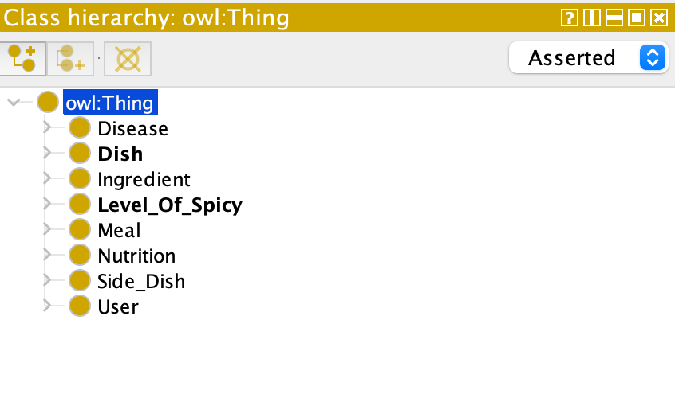

### Applying Disjoint Classes
Disjoint classes are defined within the ontology to prevent individuals from belonging to multiple categories simultaneously, so classes that cannot overlap. For example, vitamins and carbohydrates are disjoint, meaning an instance cannot be classified as both at the same time.

### Assigning Domain and Range to Object Properties
| Row | Object Property       | Domains         | Ranges         | Inverse of       | Characteristics |
|-----|-----------------------|-----------------|-----------------|------------------|------------------|
| 1   | hasIngredient         | Dish            | Ingredient      | isIngredientOf    | -                |
| 2   | isIngredientOf        | Ingredient      | Dish            | hasIngredient     | -                |
| 3   | hasNutrient           | Ingredients     | Nutrition       | -                | Transitive       |
| 4   | hasSpicyLevel         | Dish            | Level_Of_Spicy | -                | Functional       |
| 5   | servedAsMeal          | Dish            | Meal            | -                | -                |
| 6   | servedAsSideDish      | Dish            | Side_Dish       | -                | Functional       |
| 7   | dislikeIngredient      | User            | Ingredient      | -                | Transitive       |
| 8   | likeIngredient         | User            | Ingredient      | isLikedBy        | Transitive       |
| 9   | hasAllergyTo         | User            | Ingredient      | isAllergicTo     | -                |
| 10  | isAllergicTo         | Ingredient      | User            | hasAllergyTo     | -                |
| 11  | affectUserLife       | Disease         | User            | sufferFromDisease | -                |
| 12  | sufferFromDisease     | User            | Disease         | affectUserLife    | -                |
| 13  | helpWithDisease       | Nutrition       | Disease         | -                | -                |

The explanation for each row in the **"Assigning Domain and Range to Object Properties"** table, is provided below:

1. **hasIngredient**
   - **Domains**: Dish
   - **Ranges**: Ingredient
   - **Inverse of**: isIngredientOf
   - **Characteristics**: Inverse relationship
   - **Explanation**: This property indicates that a dish is composed of one or more ingredients. Each dish must have at least one ingredient associated with it, establishing a direct relationship between dishes and their ingredients. The inverse relationship, `isIngredientOf`, indicates that an ingredient can be part of one or more dishes.

2. **isIngredientOf**
   - **Domains**: Ingredient
   - **Ranges**: Dish
   - **Inverse of**: hasIngredient
   - **Characteristics**: Inverse relationship
   - **Explanation**: This property defines the relationship from the perspective of the ingredient, indicating that an ingredient can be part of a dish. It complements the `hasIngredient` property, emphasizing the bidirectional nature of the relationship between dishes and their ingredients.

3. **hasNutrient**
   - **Domains**: Ingredients
   - **Ranges**: Nutrition
   - **Inverse of**: -
   - **Characteristics**: Transitive
   - **Explanation**: This property signifies that ingredients contain various nutrients. The transitive nature means that if a dish has an ingredient, and that ingredient has a nutrient, then the dish also has that nutrient. This allows for a hierarchical understanding of nutritional content.

4. **hasSpicyLevel**
   - **Domains**: Dish
   - **Ranges**: Level_Of_Spicy
   - **Inverse of**: -
   - **Characteristics**: Functional
   - **Explanation**: This property defines the spiciness of a dish, categorizing it as either hot or mild. It is functional because each dish can only have one spiciness level; it cannot be both hot and mild simultaneously.

5. **servedAsMeal**
   - **Domains**: Dish
   - **Ranges**: Meal
   - **Inverse of**: -
   - **Characteristics**: -
   - **Explanation**: This property indicates that a dish can be served as a specific meal type, such as breakfast, lunch, or dinner. Unlike functional properties, a dish can be served in multiple meal contexts, allowing for flexibility in meal planning.

6. **servedAsSideDish**
   - **Domains**: Dish
   - **Ranges**: Side_Dish
   - **Inverse of**: -
   - **Characteristics**: Functional
   - **Explanation**: This property specifies that a dish can serve as a side dish. It is functional because a specific dish can be categorized as a side dish, but it can also fulfill other roles, such as an appetizer or dessert.

7. **dislikeIngredient**
   - **Domains**: User
   - **Ranges**: Ingredient
   - **Inverse of**: -
   - **Characteristics**: Transitive
   - **Explanation**: This property indicates that a user may dislike certain ingredients. The transitive nature implies that if a user dislikes an ingredient, they may also dislike dishes containing that ingredient.

8. **likeIngredient**
   - **Domains**: User
   - **Ranges**: Ingredient
   - **Inverse of**: isLikedBy
   - **Characteristics**: Transitive
   - **Explanation**: This property defines a user's preference for certain ingredients. Similar to the dislike property, it is transitive, meaning that if a user likes an ingredient, they may prefer dishes that include that ingredient.

9. **hasAllergyTo**
   - **Domains**: User
   - **Ranges**: Ingredient
   - **Inverse of**: isAllergicTo
   - **Characteristics**: -
   - **Explanation**: This property indicates that a user may have allergies to specific ingredients. The inverse relationship, `isAllergicTo`, highlights the potential for ingredients to cause allergic reactions in users.

10. **isAllergicTo**
    - **Domains**: Ingredient
    - **Ranges**: User
    - **Inverse of**: hasAllergyTo
    - **Characteristics**: -
    - **Explanation**: This property describes the relationship from the ingredient's perspective, indicating that certain ingredients may cause allergies in users. It complements the `hasAllergyTo` property.

11. **affectUserLife**
    - **Domains**: Disease
    - **Ranges**: User
    - **Inverse of**: sufferFromDisease
    - **Characteristics**: -
    - **Explanation**: This property indicates that certain diseases can impact a user's life. It establishes a direct relationship between diseases and users, highlighting the relevance of health conditions in dietary recommendations.

12. **sufferFromDisease**
    - **Domains**: User
    - **Ranges**: Disease
    - **Inverse of**: affectUserLife
    - **Characteristics**: -
    - **Explanation**: This property defines the relationship from the user's perspective, indicating that users may suffer from specific diseases. It complements the `affectUserLife` property, emphasizing the impact of health on dietary choices.

13. **helpWithDisease**
    - **Domains**: Nutrition
    - **Ranges**: Disease
    - **Inverse of**: -
    - **Characteristics**: -
    - **Explanation**: This property signifies that certain nutritional elements can aid in managing or alleviating specific diseases. It establishes a connection between nutrition and health conditions, emphasizing the importance of dietary considerations in treatment.

### Data Properties and Relations
Data properties are used to describe attributes of classes. These properties provide quantitative information about dishes and ingredients, enabling more precise dietary recommendations.

| Top Data Properties    | Characteristic | Type    |
|------------------------|----------------|---------|
| hasCalorieValue        | Functional     | Integer |
| hasSaltAmountGram      | Functional     | Integer |
| hasSugarAmountGram     | Functional     | Integer |
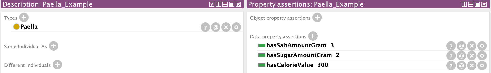
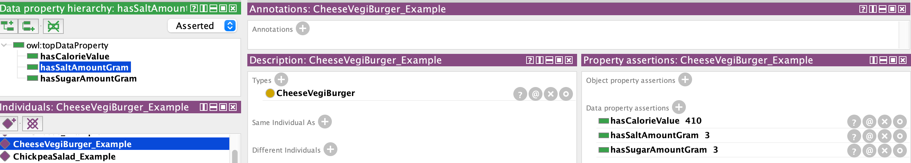

### Property and Value Restrictions 
The ontology employs property restrictions to define specific conditions for classes. These restrictions help refine the classification of dishes based on user needs.
For example, utilizes property restrictions like existential and universal quantifiers to define complex dishes, vegan dishes, and more.
- **Complex_Dish**: Dish and (hasIngredient min 10 owl:Thing)
- **VeganDish**: Dish and (hasIngredient only PlantBasedIngredient)
- **HighProteinDish**: Dish and ((hasIngredient some Bean) or (hasIngredient some Chickpea) or (hasIngredient some Lentil) or (hasIngredient some Quinoa))

- *Overview of the Universal Restriction in the Food Ontology.*
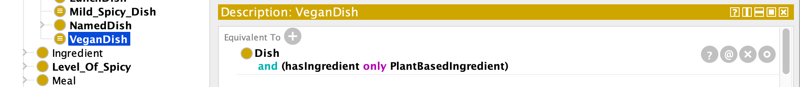

- *Overview of the Cardinality Restriction in the Food Ontology.*

### Applying Closure Axiom
The closure axiom is used to define constraints on classes. For example, a dish like Hummus can only be made with specific ingredients such as chickpeas, olive oil, pepper, and salt. This ensures that the ontology accurately reflects the relationships between dishes and their components.

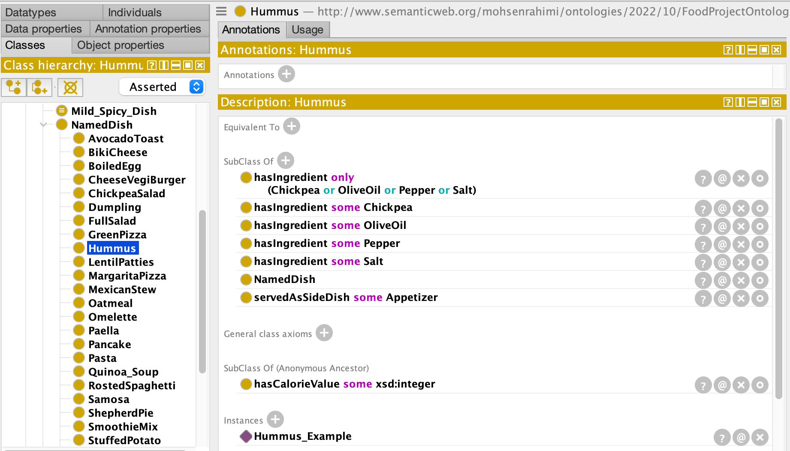

### Changing a Primitive Class to a Defined Class
By adding sufficient conditions to necessary conditions, a primitive class can be transformed into a defined class. This process enhances the specificity and usability of the ontology.
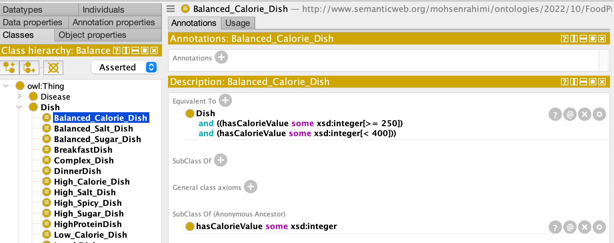

### Using the Reasoner
The reasoner is a critical component that evaluates the consistency of the ontology. It helps maintain the hierarchy by recognizing which concepts fit specific definitions. The reasoner can also infer new relationships and properties based on existing data, enhancing the ontology's functionality.

    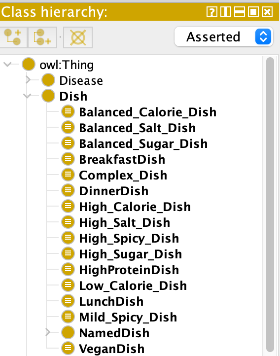
    
    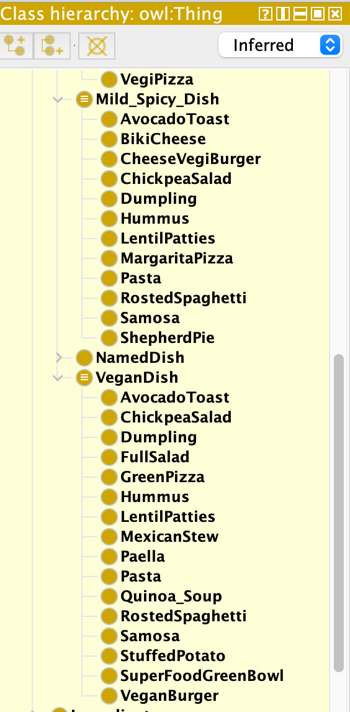

### Visual Representations
- Include relevant images or diagrams to illustrate the relationships and class structures.

**Illustrating the subclasses of diseases, minerals that are recommended to use for the specified diseases and then the food that contain those specific minerals.**

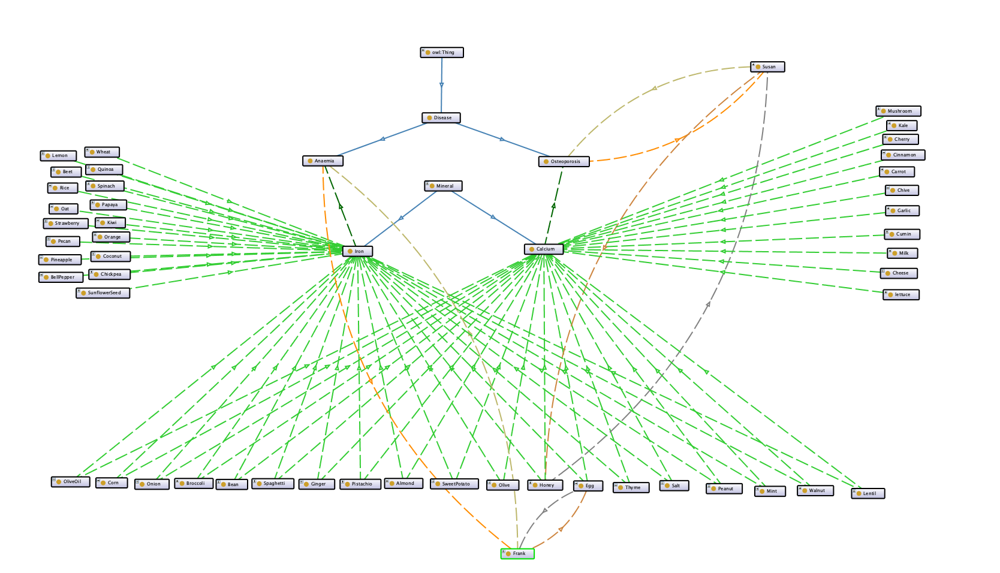

**Representing the Meal and showing Breakfast is a subclass of Meal and BreakfastDish. Moreover, showing the ingredients and nutrients which exist in some type of breakfasts.**

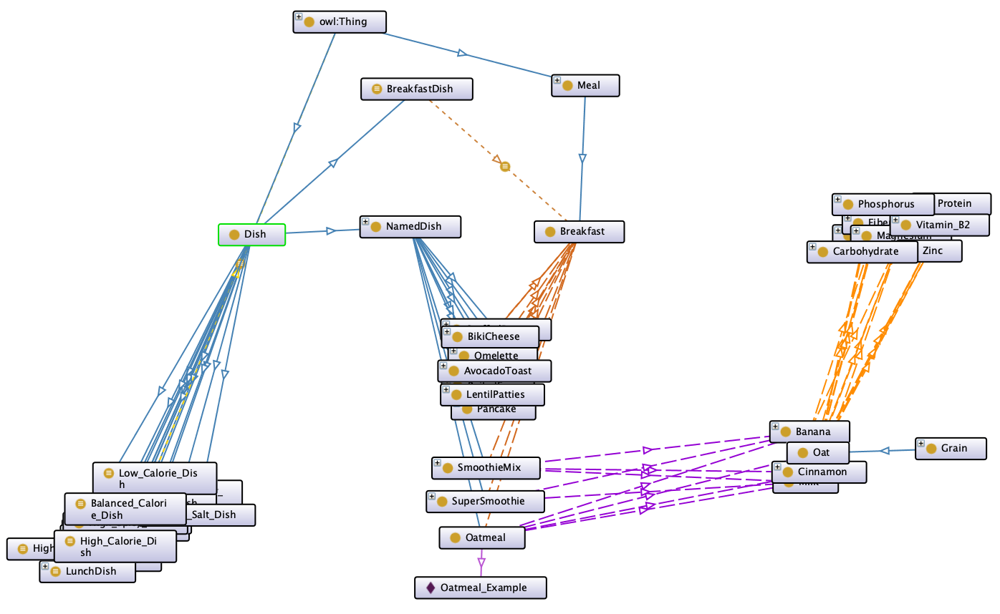

**Representing the Level_Of_Spicy based on two different ingredients which have some nutrients in common. Moreover, representing the dishes in these two different categories (mild and hot).**

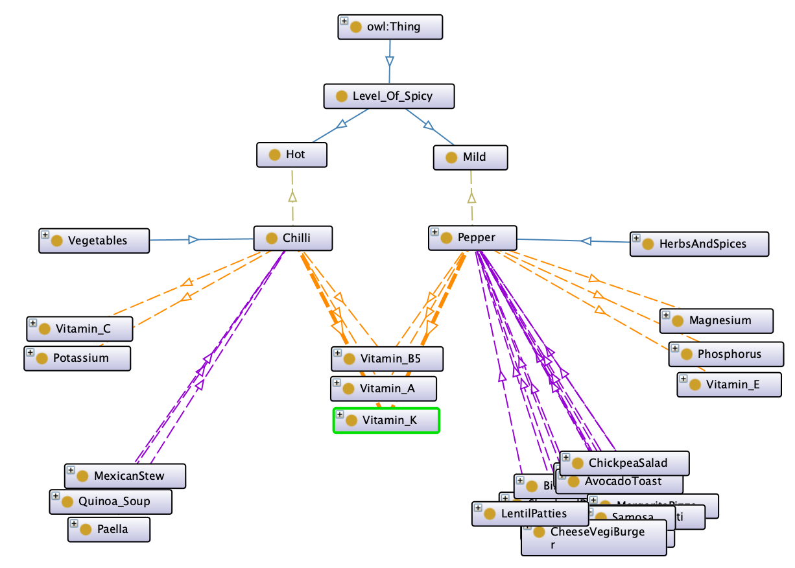

**Representing that Phosphorous is a mineral, and the ingredients contain Phosphorous. For example, Honey has Phosphorous which is used in some Dishes and showing that Susan has allergy to Honey.**

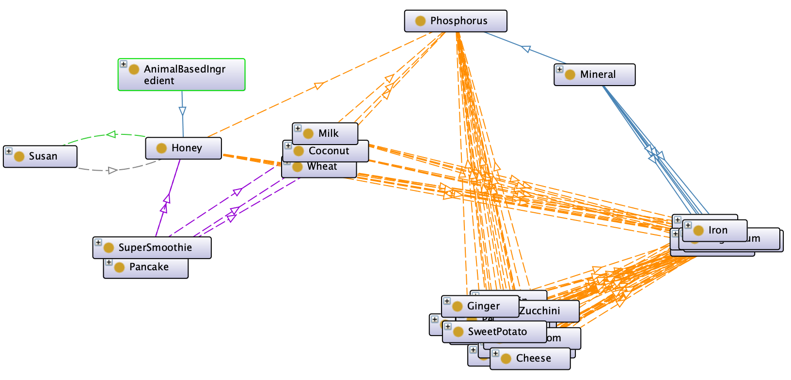

## Applications
The Food Recommendation Ontology can be applied in various domains, including:
- Restaurants: To offer personalized menu recommendations based on customer preferences and dietary restrictions.
- Food Industry: For product labeling and nutritional information dissemination.
- Healthcare: To provide dietary advice tailored to patients' health conditions.

## Examples
Expected queries to be answered, such as:
- Query 1
**Recommend the user dishes with the calorie value between 300 and 420, also contain kale or spinach or tomato but no peanut.**
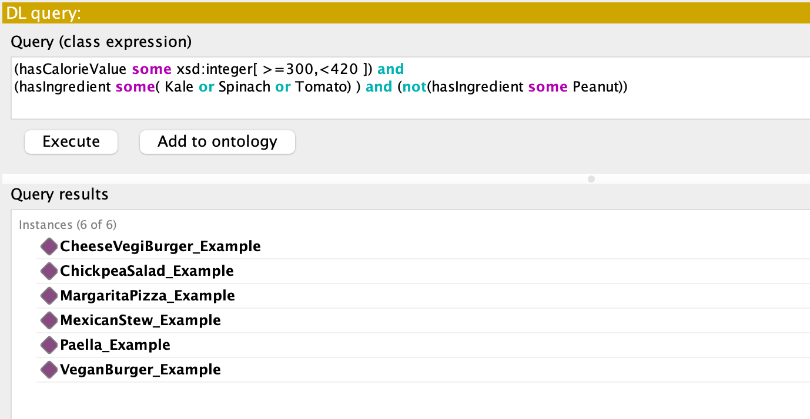

- Query 2
**Recommend Sara a mild-spicy dinner without the ingredients which she has allergy to them**

- Query 3
**Recommend a high protein dinner to Susan and Frank which can help them with their both diseases**

## Authors and Contributions
This project builds on works by several authors, including Dooley et al., and utilizes methodologies from Horridge et al. and Neuhaus & Brodaric.

## Conclusion
The Food Recommendation Ontology is a versatile tool that empowers users to discover their favorite foods while ensuring that their dietary needs are met. By leveraging a robust framework of classes and properties, this ontology can suggest a variety of dishes tailored to individual preferences and health conditions.
## Contributing
Contributions to the Food Recommendation Ontology are welcome. Please fork the repository and submit a pull request with your changes.
## License
This project is licensed under the MIT License. See the LICENSE file for details.
## Contact
For inquiries, feedback or further information, please contact Mohsen at m.rahimi.hk@gmail.com

