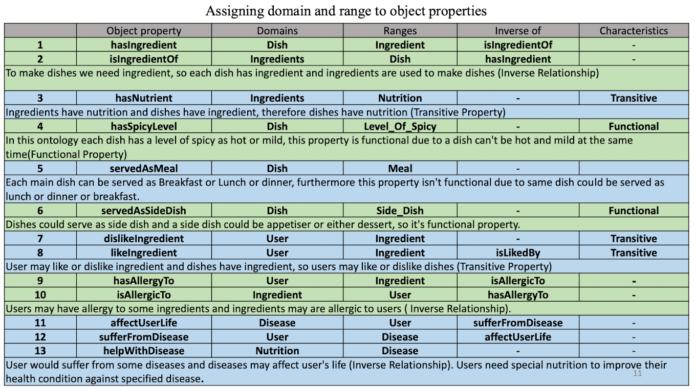

# Food Recommendation Ontology / Logical-Programming

## Table of Contents
- [Overview](#overview)
- [Installation and Usage](#installation-and-usage)
- [Features](#features)
- [Technical Details](#technical-details)
  - [Key Classes](#key-classes)
  - [Applying Disjoint Classes](#applying-disjoint-classes)
  - [Relationships Between Classes](#relationships-between-classes)
  - [Assigning Domain and Range to Object Properties](#assigning-domain-and-range-to-object-properties)
  - [Data Properties and Relations](#data-properties-and-relations)
  - [Property and Value Restrictions](#property-value-restrictions)
  - [Applying Closure Axiom](#applying-closure-axiom)
  - [Changing a Primitive Class to a Defined Class](#changing-a-primitive-class-to-a-defined-class)
  - [Using the Reasoner](#using-the-reasoner)

- [Applications](#applications)
- [Examples](#examples)
- [Conclusion](#conclusion)
- [Contributing](#contributing)
- [License](#license)
- [Contact](#contact)

## Overview
This repository contains a comprehensive food ontology written in OWL (Web Ontology Language). It aims to provide a standardized vocabulary and semantic structure for describing food products, ingredients, personalized nutritional recommendations to support healthy eating through a comprehensive food ontology and related concepts.

    
    
    

## Installation and Usage
The ontology can answer various queries, including:
- Written in OWL (Web Ontology Language)
- Developed using Protégé [5.5.0]
- Installation and Usage: (https://protege.stanford.edu)

## Features

## Technical Details
### Key Classes
- **Dish**: Represents a dish made from various ingredients.
- **Ingredient**: Classifies ingredients into animal-based and plant-based categories.
- **Nutrition**: Includes subclasses for carbohydrates, fats, fibers, proteins, minerals, and vitamins.
- **User**: Represents user preferences and dietary restrictions.
- **Disease**: Classifies various diseases that may affect dietary recommendations.

### Applying Disjoint Classes
- Classes that cannot overlap:
  - Example: Vitamin and carbohydrate are disjoint, meaning an instance cannot be both.

### Assigning Domain and Range to Object Properties
| Object Property       | Domains         | Ranges         | Characteristics     |
|-----------------------|-----------------|-----------------|----------------------|
| hasIngredient         | Dish            | Ingredient      |                      |
| isIngredientOf        | Ingredient      | Dish            | Inverse Relationship  |
| hasNutrient           | Ingredients     | Nutrition       | Transitive           |
| hasSpicyLevel         | Dish            | Level_Of_Spicy | Functional           |

- **hasIngredient**: Links dishes to their ingredients.
- **hasNutrient**: Connects ingredients to their nutritional content.
- **servedAsMeal**: Specifies when a dish can be served (e.g., breakfast, lunch, dinner).

### Data Properties and Relations
| Top Data Properties    | Characteristic | Type    |
|------------------------|----------------|---------|
| hasCalorieValue        | Functional     | Integer |
| hasSaltAmountGram      | Functional     | Integer |
| hasSugarAmountGram     | Functional     | Integer |

### Property and Value Restrictions 
Utilizes property restrictions like existential and universal quantifiers to define complex dishes, vegan dishes, and more.
- **Complex_Dish**: Dish and (hasIngredient min 10 owl:Thing)
- **VeganDish**: Dish and (hasIngredient only PlantBasedIngredient)
- **HighProteinDish**: Dish and ((hasIngredient some Bean) or (hasIngredient some Chickpea) or (hasIngredient some Lentil) or (hasIngredient some Quinoa))

- *Overview of the Universal Restriction in the Food Ontology.*

- *Overview of the Cardinality Restriction in the Food Ontology.*

### Applying Closure Axiom
- Example: Hummus can only be made with Chickpea, Olive oil, Pepper, and Salt.

### Changing a Primitive Class to a Defined Class
- By adding sufficient conditions to necessary conditions, a primitive class can be transformed into a defined class.

### Using the Reasoner
- The reasoner checks the consistency of statements and definitions in the ontology and helps maintain the hierarchy.
  

    
    
    

### Visual Representations
- Include relevant images or diagrams to illustrate the relationships and class structures.

**Illustrating the subclasses of diseases, minerals that are recommended to use for the specified diseases and then the food that contain those specific minerals.**

**Representing the Meal and showing Breakfast is a subclass of Meal and BreakfastDish. Moreover, showing the ingredients and nutrients which exist in some type of breakfasts.**

**Representing the Level_Of_Spicy based on two different ingredients which have some nutrients in common. Moreover, representing the dishes in these two different categories (mild and hot).**

**Representing that Phosphorous is a mineral, and the ingredients contain Phosphorous. For example, Honey has Phosphorous which is used in some Dishes and showing that Susan has allergy to Honey.**

## Applications
The ontology can be applied in various domains, including restaurants, the food industry, and domestic settings.

## Examples
Expected queries to be answered, such as:
- Query 1
**Recommend the user dishes with the calorie value between 300 and 420, also contain kale or spinach or tomato but no peanut.**

- Query 2
**Recommend Sara a mild-spicy dinner without the ingredients which she has allergy to them**

- Query 3
**Recommend a high protein dinner to Susan and Frank which can help them with their both diseases**

## Authors and Contributions
This project builds on works by several authors, including Dooley et al., and utilizes methodologies from Horridge et al. and Neuhaus & Brodaric.

## Conclusion
The Food Recommendation Ontology is a versatile tool for suggesting dishes that meet users' nutritional needs and preferences, promoting healthier eating habits.
 
## Contributing
[Guidelines for contributing to the project]

## License
This project is licensed under [specify license].

## Contact
For questions or feedback, please contact [your contact information].

